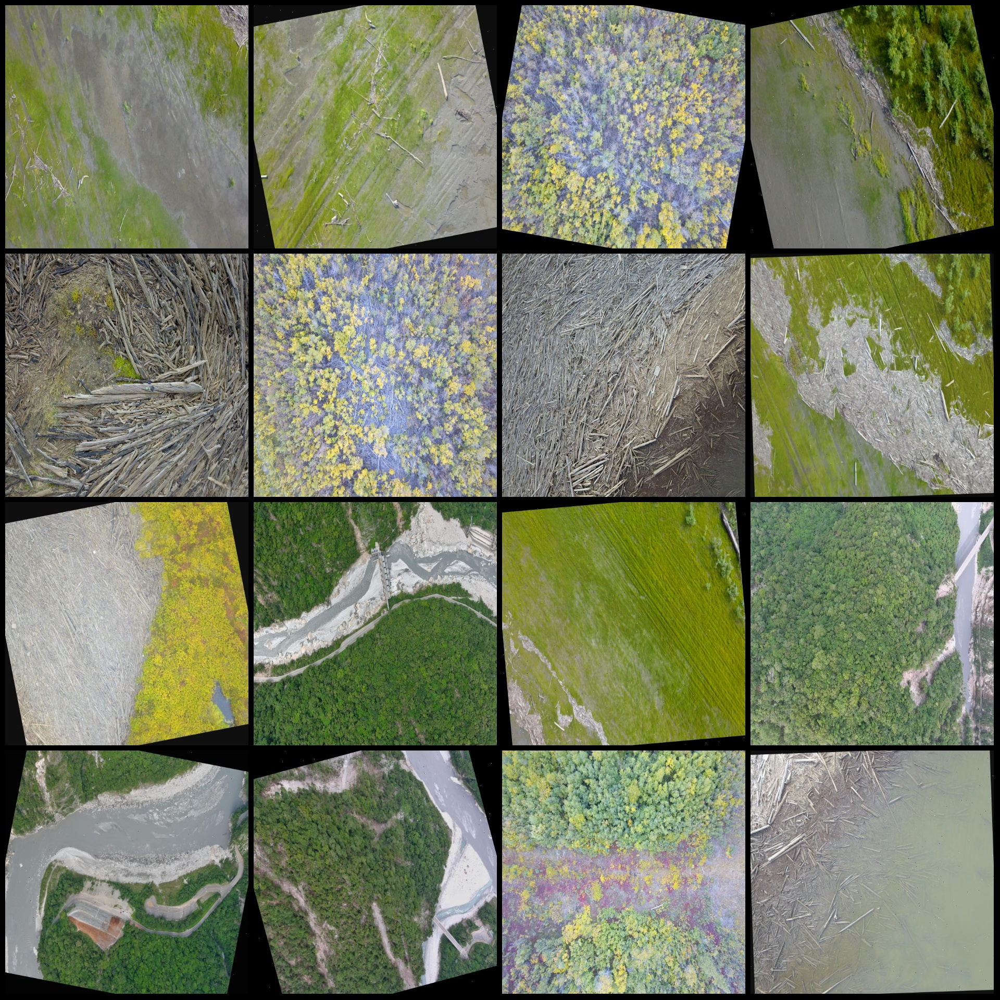
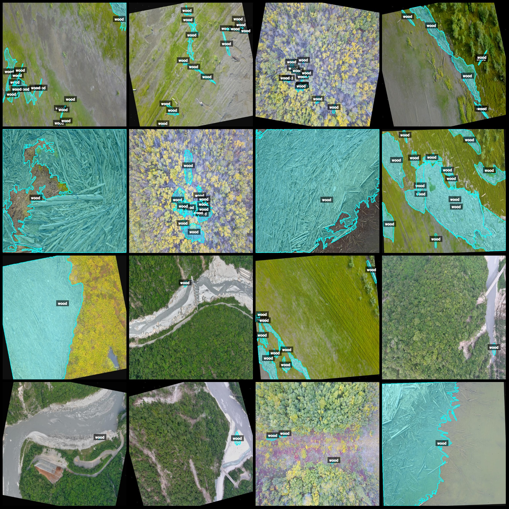
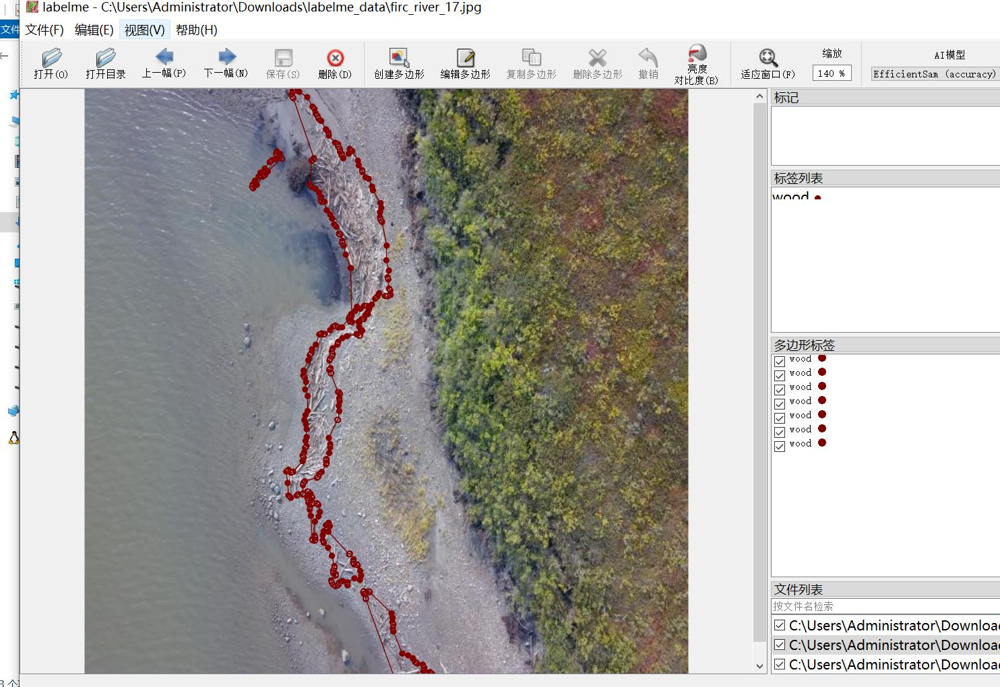

# Drone Perspective Riverbank Floatwood Identification and Segmentation Dataset in LabelMe Format: 1345 Images, 1 Category

Note that approximately 570 images are originals, with the remaining being enhanced images. The main algorithm used is rotation enhancement.

Dataset format: LabelMe format (does not include mask files, only contains JPG images and corresponding JSON files).

Number of images (JPG file count): 1345
Number of annotations (JSON file count): 1345
Number of annotation categories: 1
Annotation category names: ["wood"]
Number of bounding boxes for each category:  
wood count = 7880  
Total number of bounding boxes: 7880  
Using labelme tool: LabelMe = 5.5.0  
Image resolution: 640x640  
Annotation rules: Polygon drawing for category classification.
Important note: This dataset can be edited using LabelMe, but JSON datasets need to be converted into either Yolo or COCO format for semantic segmentation or instance segmentation.
Special declaration: This dataset does not guarantee the accuracy of the trained models or weight files.

Image preview:
Annotation examples:
Randomly selected 16 images for annotation:
Annotation drawing results:
LabelMe editing image example:

## Images

Here is a pay link on Stripe ( https://buy.stripe.com/3cs8yP7sY87d0vu9AB ). Please contact me lonlonago@foxmail.com after funding $89, and I will send you a complete data files , thank you!

